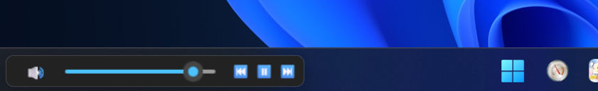

# Tabavoco - Taskbar Volume Control App

A lightweight WinUI 3 volume control application that provides persistent, easily accessible system volume control from the bottom left corner of your screen.



## Features

- **Always-on-top volume control** - Stays above all windows including taskbar
- **System volume integration** - Direct control of Windows master volume
- **Mute toggle** - Quick mute/unmute with visual feedback
- **Draggable interface** - Move the control anywhere on screen
- **Minimal footprint** - No taskbar presence, small memory usage
- **Right-click context menu** - Easy exit and run on startup option
- **External sync** - Automatically detects and syncs with volume changes made by other applications

## Build & Run

### Requirements
- .NET 9.0
- Windows 10.0.19041.0 or higher
- Platforms: x64, x86, ARM64

### Build Commands
```bash
# From WSL2
dotnet.exe build

# From Windows Command Prompt
dotnet build

# Run the application
dotnet run
```

## Packaging

Build for distribution (WinUI 3 has compatibility issues with self-contained publishing):

```bash
dotnet.exe build -c Release
```

Output will be in `bin/x64/Release/net9.0-windows10.0.19041.0/win-x64/`

The entire directory can be distributed, but requires .NET 9.0 Desktop Runtime on target machines.

> **Note**: Self-contained publishing is not supported due to WinRT projection compatibility issues with WinUI 3.

## Architecture

### Key Components

- **VolumeManager.cs** - Windows Core Audio API integration for system volume control
- **Win32WindowManager.cs** - Win32 API wrapper for window positioning and styling
- **MiniVolumeWindow.xaml/.cs** - Main UI window with volume slider and mute button
- **App.xaml.cs** - Application entry point and lifecycle management

### Technical Details

- Uses Windows Core Audio API (IAudioEndpointVolume) for direct system volume access
- Win32 API calls ensure window stays above taskbar and doesn't appear in task switcher
- Timer-based topmost enforcement overcomes Windows taskbar z-index changes
- Pointer events enable drag-to-move functionality

## Testing (Manual)

- App starts at bottom-left
- App is initialized with current volume
- Slider changes system volume 
- Mute button toggles system mute 
- Window stays above taskbar 
- Dragging moves window
- Right click to exit

## Development

### Project Structure
```
src/
├── App.xaml(.cs)           # Application entry point
├── MiniVolumeWindow.xaml(.cs) # Main UI window
├── VolumeManager.cs        # System volume integration
├── Win32WindowManager.cs   # Window positioning/styling
└── Imports.cs             # Global imports
```

### Development Guidelines
- Always add comments explaining why code is implemented a particular way
- Test manually after changes to volume or window management code
- Use Debug.WriteLine for troubleshooting COM/Win32 API issues

## License

MIT