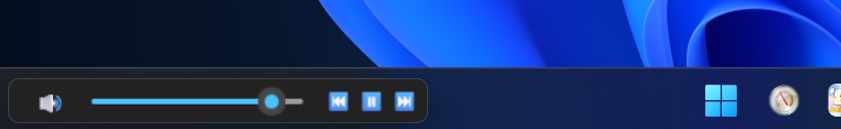

# Tabavoco - Taskbar Volume Control

A lightweight Windows volume control overlay that sits above the taskbar for quick access.



## Features

- Always-on-top volume slider that stays above the taskbar
- System volume and mute control
- Media playback controls (play/pause, next, previous)
- Draggable to any screen position with position memory
- Syncs with volume changes from other apps
- Run on startup option via right-click menu
- Minimal footprint - hidden from taskbar and Alt+Tab

## Installation

Download the latest release from the [releases page](https://github.com/swax/Tabavoco/releases), unzip, and run `tabavoco.exe`.

## Build from Source

Requires .NET 9.0 and Windows 10 1809+.

```bash
dotnet build
dotnet run

# Publish self-contained (~80MB, includes .NET runtime)
dotnet publish -c Release -r win-x64
```

Output: `bin/Release/net9.0-windows10.0.19041.0/win-x64/publish/`

Supports x64, x86, and ARM64.

## Architecture

See [docs/ARCHITECTURE.md](docs/ARCHITECTURE.md) for technical details.

## License

MIT
